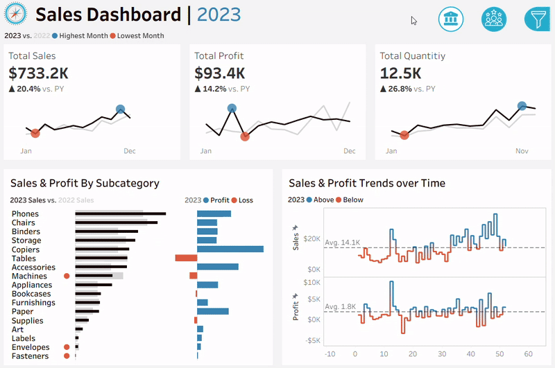
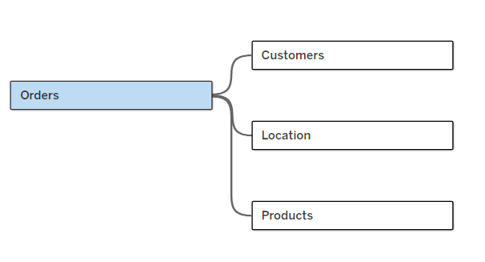
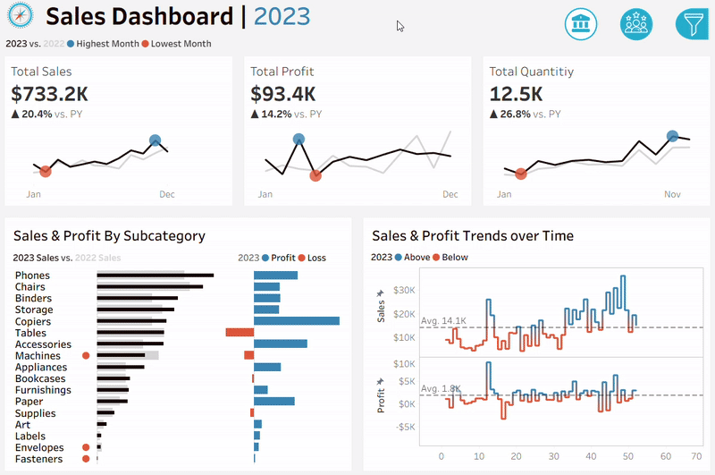

# Tableau Sales and Customer Analysis Dashboard



## Table of Contents
- [Introduction](#introduction)  
- [Datasets](#datasets)  
- [Dashboard File](#dashboard-file)  
- [Skills Demonstrated](#skills-demonstrated)  
- [Dashboard Overview](#dashboard-overview)  
  - [Sales Dashboard](#sales-dashboard)  
  - [Customer Dashboard](#customer-dashboard)  
- [Conclusion](#conclusion)  

## Introduction
This project demonstrates advanced data visualization using **Tableau**.

The goal was to analyze and compare sales and customer performance across time, leveraging KPIs, interactive dashboards, and calculated fields.  

Both dashboards include **cross-filtering interactivity**: selecting values in one chart dynamically updates related charts.

They also share a **filters panel with dropdown menus in the top-right corner** for Year, Product Category, Sub-Category, Region, State, and City, which apply across all dashboards.  

## Datasets
The analysis is based on multiple relational datasets connected through a **fact-dimension schema**:  

- [Orders](datasets/eu/Orders.csv) — **Fact table**  
- [Customers](datasets/eu/Customers.csv) — **Dimension table**  
- [Location](datasets/eu/Location.csv) — **Dimension table**  
- [Products](datasets/eu/Products.csv) — **Dimension table**  

**Data Model:**  


## Dashboard File
- Local Tableau Project: [Project.twb](Project.twb)  
- Published Tableau Public Link: [Click Here!](https://public.tableau.com/app/profile/zoran.gusic/viz/Project_17579342118350/SalesDashboard)  

## Skills Demonstrated
- Dashboard creation and design (layout, interactivity, storytelling)  
- Cross-filtering between charts  
- Interactive filters (Year, Product Category, Sub-Category, Region, State, City)  
- Year-over-Year (YoY) comparisons  
- Time series analysis (Current Year vs. Previous Year)  
- KPI development with calculated fields  
- Data modeling with fact and dimension tables  

**Examples of Calculated Fields:**  
<details>
  <summary>See code</summary>

  - Current Year Sales  
    ```tableau
    IF YEAR([Order Date]) = [Select Year] THEN [Sales (Number)]
    END
    ```

  - Previous Year Sales  
    ```tableau
    IF YEAR([Order Date]) = [Select Year] - 1 THEN [Sales (Number)]
    END
    ```

  - Year-over-Year Sales Growth  
    ```tableau
    (SUM([CY Sales]) - SUM([PY Sales])) / SUM([PY Sales])
    ```

  - Min/Max Sales  
    ```tableau
    IF SUM([CY Sales]) = WINDOW_MIN(SUM([CY Sales]))
    THEN SUM([CY Sales])
    ELSEIF SUM([CY Sales]) = WINDOW_MAX(SUM([CY Sales]))
    THEN SUM([CY Sales])
    END
    ```
</details>  

## Dashboard Overview

### Sales Dashboard
  

The Sales Dashboard highlights:  
- **Total Sales, Profit, and Quantity** with YoY growth  
- **Sales & Profit by Subcategory** with profit-loss split  
- **Weekly Sales & Profit Trends** compared to prior year  
- Identification of top-performing and underperforming categories  

### Customer Dashboard
  

The Customer Dashboard highlights:  
- **Total Customers, Sales per Customer, Orders** with YoY change  
- **Customer Distribution by Number of Orders**  
- **Top Customers by Sales, Profit, and Last Order Date**  
- Identification of high-value customers and segments for targeted strategies  

## Conclusion
This project demonstrates:  
- Building relational models for business datasets  
- Developing KPIs with Tableau calculations  
- Designing interactive dashboards for decision-making  
- Applying best practices in data visualization and storytelling  

Both dashboards provide executives and analysts with actionable insights on **sales performance** and **customer behavior**.  
